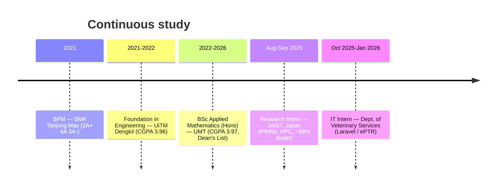
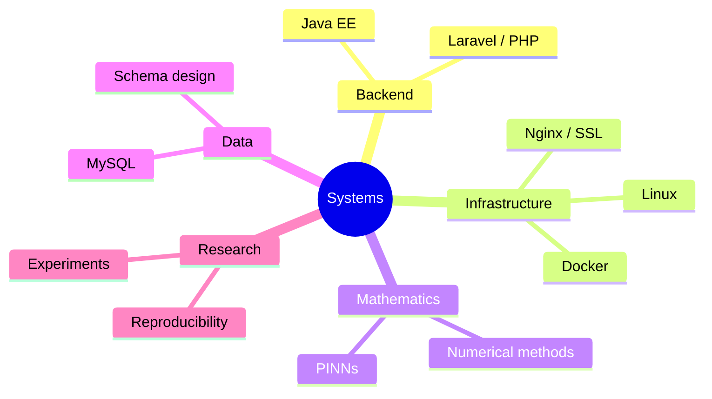

<p align="center">
  
</p>

<p align="center">
  <a href="https://karami.my"></a>
  <a href="https://www.linkedin.com/in/aimankarami"></a>
  <a href="mailto:aimankarami27@gmail.com"></a>
</p>

---

```txt
> whoami
Muhamad Noraiman Karami (Aiman)
> role
applied_mathematician + backend_developer
> status
BSc Applied Mathematics (Hons), UMT — graduating 2026
> motto
building systems that endure
```

## 👋 Hi, I'm Aiman

Applied Mathematics (Hons) student at **Universiti Malaysia Terengganu** with a soft spot
for backend development, infrastructure, and turning mathematical ideas into things that
actually run. I like understanding the whole path — from an equation or a user need, down
to the database, up through the application, and out to a server that stays up.

- 🔭 Researching **Physics-Informed Neural Networks (PINNs)** and numerical methods.
- 🛠️ Building backend apps with **Laravel** and **Java EE**, and deploying them on Linux.
- 📚 Always studying — logic first, then clean, maintainable code.
- 🌸 Quietly obsessed with elegant systems and quiet, well-earned knowledge.

## 🧰 Toolbox


Also comfortable with SAS, Maple, and Git.

## 🛠️ What I've built (click to expand)

<details>
<summary>🎬 <b>Veloura Cinema</b> — production movie booking platform</summary>

<br>

A Java-based movie booking platform deployed on production Linux infrastructure.

- Configured the Tomcat deployment environment
- Integrated the MySQL database architecture
- Set up SSL and an Nginx reverse proxy
- Deployed on VPS infrastructure

**Stack:** `Java EE` · `Tomcat` · `MySQL` · `Docker` · `Nginx`

</details>

<details>
<summary>📚 <b>eKursus System</b> — centralized course workflow platform</summary>

<br>

A platform replacing manual, form-based course workflows with a structured system.

- Designed the primary relational database structure
- Replaced disjointed Google Forms with structured data collection
- Implemented role-based administrative workflows

**Stack:** `Laravel` · `PHP` · `MySQL`

</details>

<details>
<summary>🐄 <b>Livestock Management System (ePTR)</b> — internal ops app</summary>

<br>

An internal web application for managing livestock data and daily operations, built
during my IT internship at the Department of Veterinary Services.

**Stack:** `Laravel` · `PHP` · `MySQL`

</details>

<details>
<summary>🔬 <b>rcPINN</b> — Restarting–Chunking PINN framework</summary>

<br>

A forward-in-time training framework that improves PINN stability over long time
horizons by splitting the temporal domain into segments — better convergence than
vanilla PINNs.

**Stack:** `Python` · `TensorFlow/Keras` · `RK4`

</details>

<details>
<summary>♾️ <b>Enhanced rcPINN (FAC)</b> — Fibonacci Adaptive Chunking</summary>

<br>

An extension of rcPINN introducing a self-adaptive, Fibonacci-based chunking strategy
that balances training speed and stability — no manual tuning required.

**Stack:** `Python` · `TensorFlow/Keras` · `Numerical Methods`

</details>

## 🧭 My journey so far



## 🧠 How I think about skills



## � Let's connect

- 🌐 **Portfolio:** [karami.my](https://karami.my)
- � **LinkedIn:** [aimankarami](https://www.linkedin.com/in/aimankarami)
- ✉️ **Email:** aimankarami27@gmail.com

<p align="center"><sub>“An idiot admires complexity, a genius admires simplicity.” — Terry A. Davis</sub></p>
