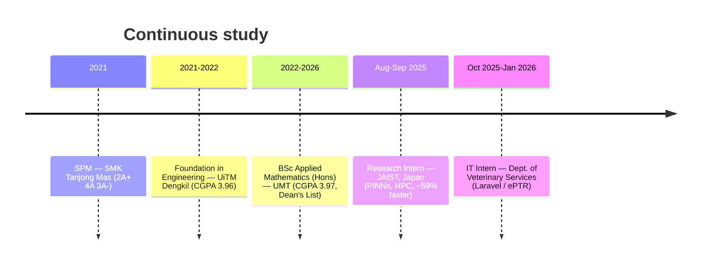
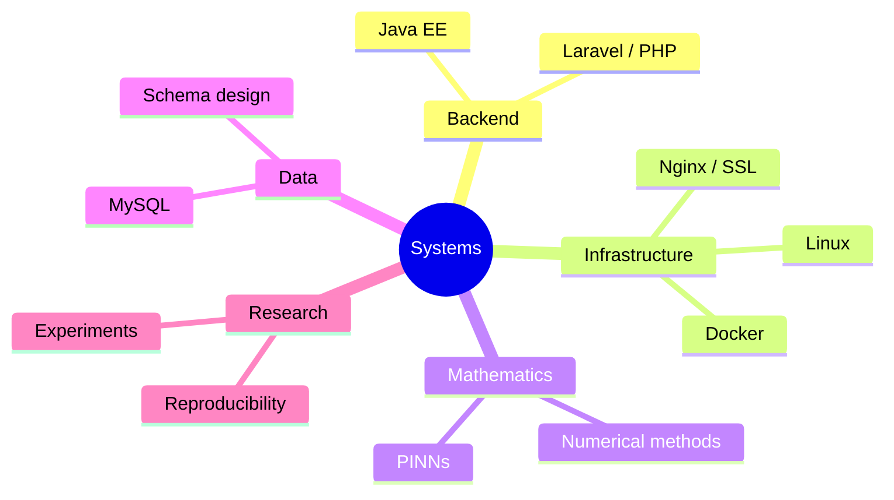

<p align="center">
  
</p>

<p align="center">
  <a href="https://aimnkrmi.github.io"></a>
  <a href="https://www.linkedin.com/in/aimankarami"></a>
  <a href="mailto:aimankarami27@gmail.com"></a>
</p>

<p align="center">
  <a href="#-about">About</a> ·
  <a href="#-toolbox">Toolbox</a> ·
  <a href="#-selected-work-click-to-expand">Work</a> ·
  <a href="#-the-journey">Journey</a> ·
  <a href="#-run-it-locally">Run</a> ·
  <a href="#-deploy-to-github-pages">Deploy</a>
</p>

---

```txt
> whoami
applied_mathematician + backend_developer
> currently
BSc Applied Mathematics (Hons), UMT — graduating 2026
> building
systems that endure
```

> **Heads up:** GitHub sanitizes README Markdown, so there's no JavaScript here.
> The "interactive" bits below are things GitHub *does* support natively — click the
> ▶ arrows to expand sections, and the diagrams are live-rendered.

## 👋 About

I'm **Muhamad Noraiman Karami** (Aiman) — an Applied Mathematics (Hons) student at
Universiti Malaysia Terengganu with a soft spot for backend development, infrastructure,
and turning mathematical ideas into things that actually run. I like understanding the
whole path: from an equation or a user need, down to the database, up through the
application, and out to a server that stays up.

This repository is the source for my **personal portfolio website** — a static,
dependency-free site built from scratch with plain HTML, CSS, and JavaScript.

<details>
<summary><b>✨ What makes the site itself interesting</b></summary>

<br>

- **Zero frameworks, zero build tools** — just `index.html`, `styles.css`, and `script.js`.
- **Fully local** — fonts, icons, and documents are self-hosted under `assets/`. No CDNs, no external requests.
- **Motion in vanilla JS** — custom cursor, scroll reveals, animated counters, a typing effect, tilt cards, an interactive skill constellation, and a small in-page terminal.
- **Mathematics theme** — a scrolling equation band, background math glyphs, and terminal commands like `euler`, `fib`, and `pi`.
- **Performance-minded** — GPU-friendly transforms, `content-visibility` on offscreen sections, and an automatic low-power mode for weaker devices.
- **Mobile-first & accessible** — responsive from 320px up, semantic HTML, keyboard navigation, and full `prefers-reduced-motion` support.
- A few **easter eggs** — try typing `robin`, the Konami code, or double-clicking the logo. 🌸

</details>

## 🧰 Toolbox


Also: SAS, Maple, Git, and a fair amount of curiosity.

## 🛠️ Selected work (click to expand)

<details>
<summary>🎬 <b>Veloura Cinema</b> — production movie booking platform</summary>

<br>

A Java-based movie booking platform deployed on production Linux infrastructure.

- Configured the Tomcat deployment environment
- Integrated the MySQL database architecture
- Set up SSL and an Nginx reverse proxy
- Deployed on VPS infrastructure

**Stack:** `Java EE` · `Tomcat` · `MySQL` · `Docker` · `Nginx`

</details>

<details>
<summary>📚 <b>eKursus System</b> — centralized course workflow platform</summary>

<br>

A platform replacing manual, form-based course workflows with a structured system.

- Designed the primary relational database structure
- Replaced disjointed Google Forms with structured data collection
- Implemented role-based administrative workflows

**Stack:** `Laravel` · `PHP` · `MySQL`

</details>

<details>
<summary>🐄 <b>Livestock Management System (ePTR)</b> — internal ops app</summary>

<br>

An internal web application for managing livestock data and daily operations, built
during my IT internship at the Department of Veterinary Services.

**Stack:** `Laravel` · `PHP` · `MySQL`

</details>

<details>
<summary>🔬 <b>rcPINN</b> — Restarting–Chunking PINN framework</summary>

<br>

A forward-in-time training framework that improves PINN stability over long time
horizons by splitting the temporal domain into segments — better convergence than
vanilla PINNs.

**Stack:** `Python` · `TensorFlow/Keras` · `RK4`

</details>

<details>
<summary>♾️ <b>Enhanced rcPINN (FAC)</b> — Fibonacci Adaptive Chunking</summary>

<br>

An extension of rcPINN introducing a self-adaptive, Fibonacci-based chunking strategy
that balances training speed and stability — no manual tuning required.

**Stack:** `Python` · `TensorFlow/Keras` · `Numerical Methods`

</details>

## 🧭 The journey



## 🧠 How I think about skills



## 🚀 Run it locally

No install, no build. Clone and open:

```bash
git clone https://github.com/aimnkrmi/<repo-name>.git
cd <repo-name>
# open index.html directly, or serve it:
python -m http.server 5500   # http://localhost:5500
```

## 🌐 Deploy to GitHub Pages

Fully static with relative paths, so it works as-is on GitHub Pages.

<details>
<summary><b>Option A — user site at <code>https://aimnkrmi.github.io</code> (recommended)</b></summary>

<br>

1. Create a repository named exactly `aimnkrmi.github.io`.
2. Push `index.html`, `styles.css`, `script.js`, and the `assets/` folder to the default branch.
3. **Settings → Pages** → set the source to that branch (root). Done.

</details>

<details>
<summary><b>Option B — project site at <code>https://aimnkrmi.github.io/&lt;repo&gt;/</code></b></summary>

<br>

1. Push these files to any repository.
2. **Settings → Pages → Deploy from branch** → pick your branch and `/root`.

</details>

> Keep the `aimnkrmi/aimnkrmi` repo as your **profile README** and link it to the live site above.

## 📁 Project structure

```txt
portfolio/
├── index.html        # markup — all sections
├── styles.css        # mobile-first styles, animations, responsive layers
├── script.js         # vanilla JS: preloader, cursor, reveals, terminal, skills…
└── assets/
    ├── fonts/         # Inter, Space Grotesk, JetBrains Mono (self-hosted woff2)
    ├── docs/          # résumé + academic PDFs
    ├── images/        # readme banner, og placeholders
    └── icons/ videos/ audio/ css/ js/
```

## 🙏 Credits

- Fonts: [Inter](https://github.com/rsms/inter), [Space Grotesk](https://github.com/floriankarsten/space-grotesk), and [JetBrains Mono](https://github.com/JetBrains/JetBrainsMono) — all under the SIL Open Font License.
- Everything else is hand-written. No template, no page builder.

## 📫 Connect

- **Email:** aimankarami27@gmail.com
- **LinkedIn:** [aimankarami](https://www.linkedin.com/in/aimankarami)
- **GitHub:** [@aimnkrmi](https://github.com/aimnkrmi)

<p align="center"><sub>“True knowledge is quiet. Its work speaks for it.”</sub></p>
